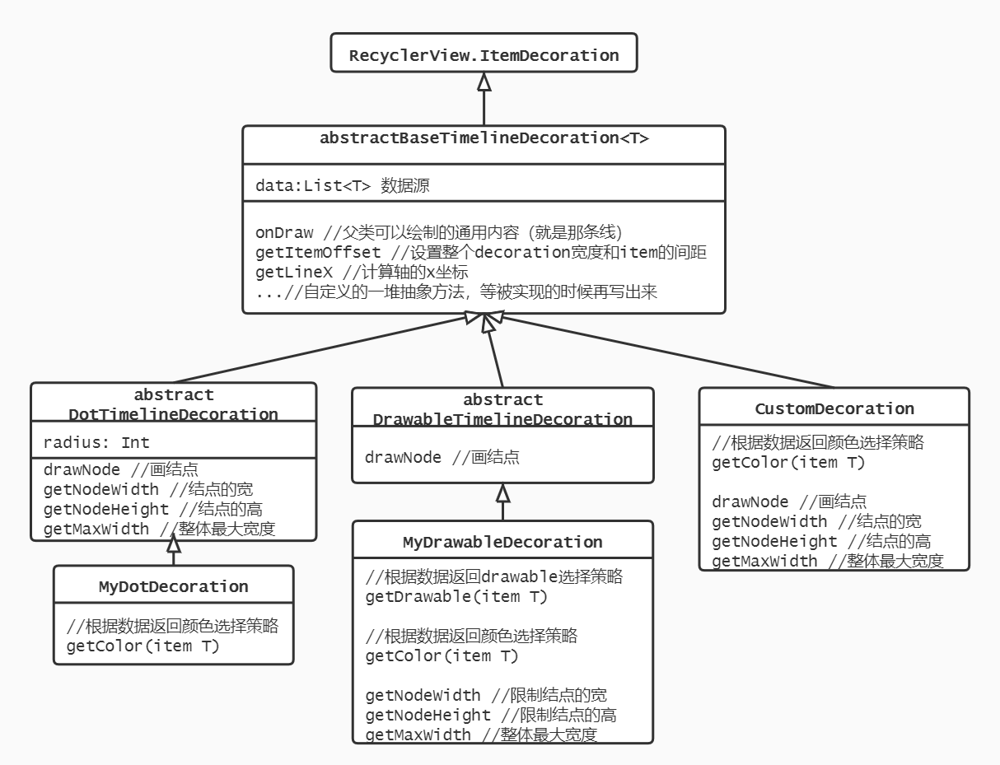

# TimelineDecoration

* 继承RecyclerView.ItemDecoration，实现竖直时间线效果
* 使用上需要继承扩展，具体看下文
* 支持根据数据状态区分颜色和结点样式（可以是圆点、图片或自定义等）
* 支持更改左右方向，顺便可以设置item之间的间距
* 还有一大堆可设置的属性

## 实现效果


## 使用方式
根据具体要的效果，继承  
`BaseTimelineDecoration / DotTimelineDecoration / DrawableTimelineDecoration`  
实现对应的抽象方法
```kotlin
// 省略声明列表、adapter等不是很有关的内容
val decor = DotDecoration()// 需要自己继承实现
decor.data = yourData
recyclerView.addItemDecoration(decor)

class DotDecoration : DotTimelineDecoration<Record>() {
    override fun getColor(item: Record, parent: RecyclerView): Int {
        return when (item.status) {
            1 -> Color.RED
            else -> Color.BLUE
        }
    }
}
```

## 实现详解
这回不是开箱即用了，使用方式可能还要从~~盘古开天~~（不是）从我都在基类里做了什么开始说起。
说真的我没想到有一天我会主动选择画UML图



完**蛋，画完还是十分混乱，不如不画。勉为其难往下写

### 前提
* 完全忘记类图的画图规则，以上都是乱画的
* 标有abstract的抽象类都不能直接使用，需要被继承
* BaseTimelineDecoration类的子类里写的都是override方法，它们都定义在base类中，但由于实现的时机不同，所以分开写
* 只写了重要属性和方法，并不完整
* 那么我们开始吧

### BaseTimelineDecoration
1. 在`onDraw`中画了力所能及的东西：众所周知，能在最基础的基类里画的也只有那条轴线了
    * 注意到本方法是对整个RecyclerView进行绘制的，所以要先循环一下children
    * 线吧，它还要分成两部分来画。有两个原因：一是第一项不画上半条线，最后一项不画下半条线；二是以结点为分隔，上半条线是上一个item的颜色，下半条线才是这一个item的颜色。（还好这里刚好能获取整个列表对象
    * 由于从RecyclerView获取的children只包括在屏幕范围中可见的，如果拿它们的position去数据源里配对的话，会出现错乱的情况。所以真正可用的position应该是`getChildAdapterPosition`
2. 由`getItemOffset`方法设置了：
    * 整个decor的宽度，考虑了方向和自带的左右padding
    * 列表item项的间距，最后一项没有（这也是decoration最常见的用途）
3. 实现了`getLineX`这个方法，用来计算轴线的x坐标，画线、画结点都可以用到。也考虑了方向
4. 定义了一堆抽象方法等待子类来实现：
    * `getColor`：让子类根据状态返回不同的轴线颜色。不直接定义成属性是因为要实现【不同状态，不同颜色】。这似乎是模板模式？
    * `drawNode`：由子类自己绘制结点
    * `getNodeWidth`和`getNodeHeight`：让子类返回结点的宽高。主要是画轴线需要知道高度
    * `getMaxWidth`：让子类返回最大结点的宽度（因为宽度也可能根据状态不一样），是用来计算整个decor的宽度和轴线的x坐标的
5. 其他可设置的属性：
    * `offset`：结点离item顶部的偏移量，一般根据具体的布局来设置
    * `itemMargin`：item的间距
    * `paddingLeft`和`paddingRight`：轴线的左右padding
    * `direction`：轴线在item左边还是右边

### DotTimelineDecoration
1. 结点都是大小相同圆点的时间线（如图中1），定义了一个重要属性就是圆的半径
2. 重写了`drawNode`，绘制圆和圆的边框
3. 重写了`getNodeWidth`和`getNodeHeight`和`getMaxWidth`，因为宽高由半径就可以确定了
4. `getColor`依然留给子类重写，这时getColor同时代表了圆和轴线的颜色（也可以设计成分开，但是反正这样看起来比较和谐），子类只要实现这个方法就可以有各种颜色的Timeline了
5. 其他可设置的属性：
    * `strokeWidth`：边框宽度
    * `strokeColor`：边框颜色（其实也可以做成抽象方法但是我懒得
    * `nodeType`：结点类型，决定是否要边框，或者只要边框。如果只要边框（如图中2），则此时用getColor方法设置边框的颜色

### DrawableTimelineDecoration
1. 结点都是drawable的时间线（如图中3），定义了一个重要属性就是drawable
2. 重写了`drawNode`，绘制drawable
3. 定义了`getDrawable`，让子类返回各种不同的drawable资源
4. `getColor`还是留给子类重写，让它返回轴线的颜色，因为不可能从drawable里同时也知道这个颜色
5. `getNodeWidth`和`getNodeHeight`和`getMaxWidth`也没实现，这样子类可以顺便控制一下drawable的大小

> 暂时只提供了以上两种大体的效果，如果还要更复杂可以直接继承base类，drawNode任你实现，比如：
### CustomDecoration
1. 实现第一个结点为图片，剩下结点为圆点的效果（如图中4）
2. 实现所有的抽象方法就好了

## 一点感想
没有具体的需求写一个控件简直全凭想象。越写越想扩展，想让它支持各种不同的场景和需求。但是其实越强大就会越复杂，用起来就更不方便了