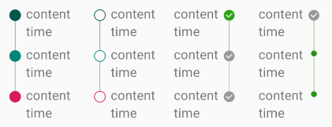
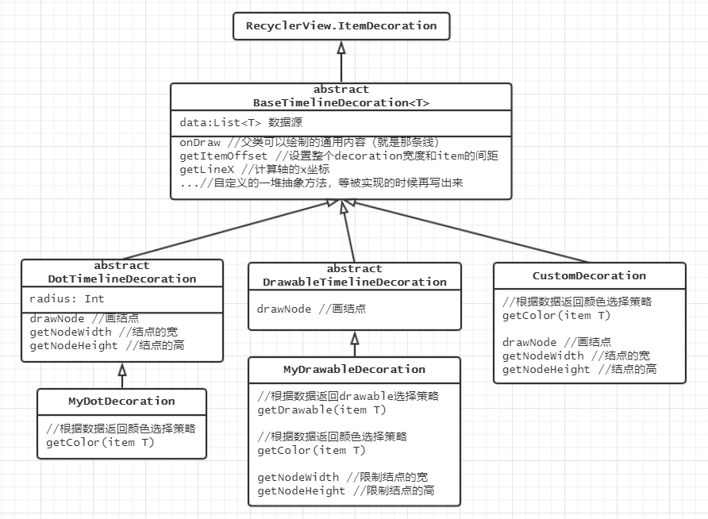

# TimelineDecoration

* 继承RecyclerView.ItemDecoration，实现竖直时间线效果
* 使用上需要继承扩展，具体看下文
* 支持根据数据状态区分颜色和结点样式（可以是圆点、图片或自定义等）
* 支持更改左右方向，顺便可以设置item之间的间距
* 还有一大堆可设置的属性

## 实现效果


## 使用和实现详解
```kotlin
// 省略声明列表、adapter等不是很有关的内容
val decor = TimelineDecoration()// 需要自己继承实现
decor.data = yourData
recyclerView.addItemDecoration(decor)
```
这回不是开箱即用了，使用方式可能还要从~~盘古开天~~（不是）从我都在基类里做了什么开始说起。
说真的我没想到有一天我会主动选择画UML图



完**蛋，画完还是十分混乱，不如不画。勉为其难往下写

### 前提
* 完全忘记类图的画图规则，以上都是乱画的
* 标有abstract的抽象类都不能直接使用，需要被继承
* BaseTimelineDecoration类的子类里写的都是override方法，它们都定义在base类中，但由于实现的时机不同，所以分开写
* 只写了重要属性和方法，并不完整
* 那么我们开始吧

### 父类中做了什么
1. 在`onDraw`中画了力所能及的东西：众所周知，能在最基础的基类里画的也只有那条轴线了
    * 注意到本方法是对整个RecyclerView进行绘制的，所以要先做一个循环children
    * 线吧，它还要分成两部分来画。因为以结点为分隔，上半条线是上一个item的颜色，下半条线才是这一个item的颜色。（还好这里刚好能获取整个列表对象
    * 第一项不画上半条线，最后一项不画下半条线哦
    * 由于RecyclerView获取的children只包括在屏幕范围中可见的，如果拿它们的position去数据源里配对的话，会出现错乱。所以真正可用的position应该是getChildAdapterPosition
2. 由`getItemOffset`方法设置了：
    * 整个decor的宽度，考虑了方向和自带的左右padding
    * 列表item项的间距，最后一项没有（这是decoration最常见的用途）
3. 实现了`getLineX`这个方法，用来计算轴线的x坐标，画线、画结点都可以用到。也要考虑方向
4. 定义了一堆抽象方法等待子类来实现：
    * `getColor(item: T)`：让子类根据状态返回不同的轴线颜色。不直接定义成属性是因为要实现【不同状态，不同颜色】
    * `drawNode`：由子类自己画结点
    * `getNodeWidth`和`getNodeHeight`：让子类返回结点的宽高。因为基类不画结点不知道宽高，但是需要设置decor的宽度和实现`getLineX`

